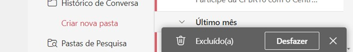
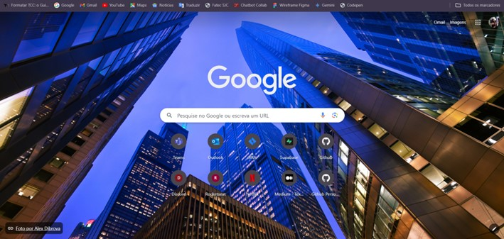
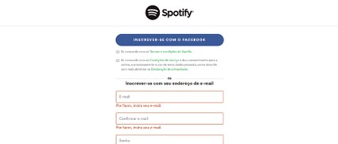
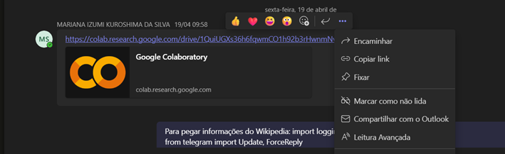
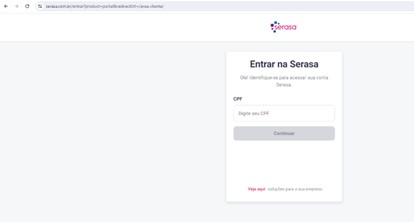
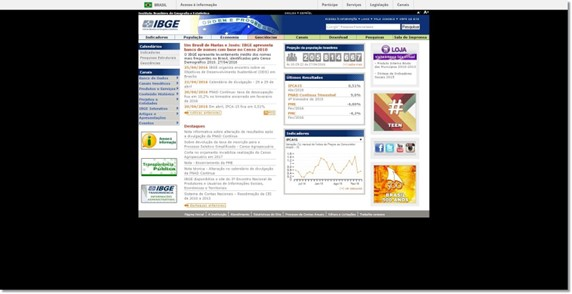
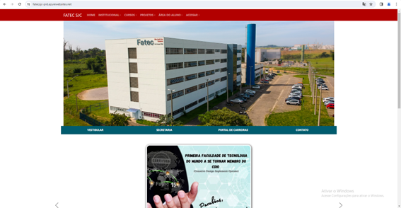

# Heurísticas de Nielsen

## :heavy_check_mark: Acerto
**Heurística nº 1: Visibilidade do status do sistema**

1.	O sistema deve sempre manter os usuários informados sobre o que está acontecendo, em tempo real, por meio de feedbacks instantâneos dentro de um prazo razoável, que servirão para orientar o usuário sobre o que está acontecendo na tela em que ele se encontra.

Quando assistimos a uma playlist no YouTube, somos informados de tudo que ocorre na tela, como a barra do player que mostra o quanto do vídeo já foi carregado, em qual parte o vídeo está, o tempo de duração dele, o quanto já foi assistido, do lado direito fica claro qual vídeo está sendo reproduzido, quais já foram assistidos e quais os próximos.

## :heavy_check_mark: Acerto
**Heurística nº 3: Controle e liberdade para o usuário**

No sistema é importante que o usuário tenha liberdade para realizar ações que ele deseja, porém muitas vezes essas ações são realizadas por engano, nessas situações deve haver uma “saída de emergência” de fácil localização, permitindo que o usuário saia daquela janela indesejada ou retorne ao ponto anterior.

O Outlook permite que o usuário desfaça a ação de excluir um e-mail, dando ao usuário o controle sobre a situação, caso ela tenha sido realizada por engano e ele deseja revertê-la.

## :heavy_check_mark: Acerto
**Heurística nº 6: Reconhecimento em vez de recordação**

Devemos minimizar a quantidade de informações que o usuário precisa memorizar, para isso, objetos, ações e opções importantes devem ficar visíveis, isso faz com que o cérebro perceba as ações que são similares, reconhecendo assim padrões.

O site do Outlook segue o padrão de outros sites em geral, dessa forma o usuário consegue se localizar e encontrar facilmente aquilo que precisa enquanto navega nele, por exemplo, a opção de login está no topo direito da página, o site apresenta um menu padrão com opções comuns a outros sites do gênero como suporte, produtos e a opção de pesquisa.

## :heavy_check_mark: Acerto
**Heurística nº 7: Flexibilidade e eficiência de uso**

O site exibe o histórico de navegação dos produtos pesquisados. Ao fornecer acesso às páginas visitadas recentemente e pesquisas realizadas no passado, o site ajuda os usuários a retomar as tarefas que deixaram incompletas e que podem ter dificuldade em lembrar.

O Chrome permite ao usuário personalizá-lo desde a aparência até preferências e facilidades, sendo possível escolher o tema (cor) preferível pelo usuário tornando o visual mais agradável, criar atalhos logo abaixo de ambas barras de pesquisa para que o usuário possa acessar rapidamente seus sites recorrentes. Novos usuários conseguem se localizar de forma rápida no navegador, pois as opções principais estão bem visíveis e em destaque na tela.

## :heavy_check_mark: Acerto
**Heurística nº 9: Auxiliar usuários a reconhecer, diagnosticar e recuperar erros**

O ponto aqui é ajudá-lo a reparar um erro depois de ele ter cometido caso o “Cntrl+Z” não tenha funcionado.
Um exemplo são aqueles avisos de formulários nos campos que não foram preenchidos corretamente. É uma forma simples de mostrar para o usuário que ele cometeu um erro, onde errou e o que precisa ser feito para corrigir tal erro.

Ao criar uma conta no Spotify os campos obrigatórios ficam com a borda vermelha sinalizando que são de preenchimento obrigatório caso o usuário não os preencha.

## :heavy_check_mark: Acerto
**Heurística nº 10: Ajuda e Documentação**

Nunca sabemos quando um usuário vai precisar de um auxílio, embora as áreas de documentação e ajuda sejam as menos acessadas, elas devem estar lá, principalmente em interfaces que possuem muitas possibilidades, pois podem ajudar o usuário a resolver um problema sozinho.  

O site da Amazon, por exemplo, possui uma página de ajuda que permite ao usuário buscar soluções rápidas e claras para possíveis problemas/dúvidas.

## :x: Erro
**Heurística nº 2: Compatibilidade entre o sistema e o mundo real**

Imagine que um jovem húngaro e um senhor sueco estejam trocando cartas entre si, a conversa entre ambos seria um tanto complicada considerando que eles não possuem um idioma em comum. O que quero dizer com essa analogia é que um sistema precisa falar a mesma linguagem do usuário, não estou falando apenas do idioma em si, mas da linguagem que o usuário utiliza no dia a dia.

Na plataforma Teams, quando clicamos em copiar link em uma mensagem, na verdade é copiado o link da mensagem em si e não o link que foi enviado como conteúdo da mensagem induzindo o usuário ao erro ao pensar que está realizando uma ação quando na verdade está realizando outra.

## :x: Erro
**Heurística nº 5: Prevenção a erros**

Fundamental para garantir uma boa usabilidade, essa heurística parte da premissa que acidentes acontecem. Às vezes por acidente ou falta de conhecimento. Se o design de interação for desenhado para reduzir esse tipo de situação, então ele melhora também a terceira heurística, que é voltada para o controle do usuário.

No site do Serasa não há sugestão para o preenchimento para dados como CPF, ou seja, se o CPF deve ser informado com “.” e “-“.

## :x: Erro
**Heurística nº 8: Estética e design minimalista**

O design ajuda muito na experiência do usuário. Quanto mais limpo e objetivo melhor. Além de questões altamente relevantes como a padronização dos botões, a composição visual também deve ser observada e facilitar a interação.

O site do IBGE nesta imagem apresenta superlotação de informações, podendo confundir o usuário ou deixar a experiência de utilização ruim ao acessá-lo.

## :x: Erro
**Heurística nº 10: Ajuda e documentação**

Se as heurísticas anteriores forem usadas, então é pouco provável que o usuário precise de ajuda. Afinal, esse é o objetivo das heurísticas de Nielsen. Mesmo assim, outro ponto fundamental é que a central de ajuda ou barra/opção de pesquisa exista e seja de fácil acesso.

O site Fatec SJC não possui um FAQ para que o usuário possa encontrar perguntas frequentes ou uma barra de busca em que o usuário possa informar a opção que estar buscando e encontrar rapidamente.
